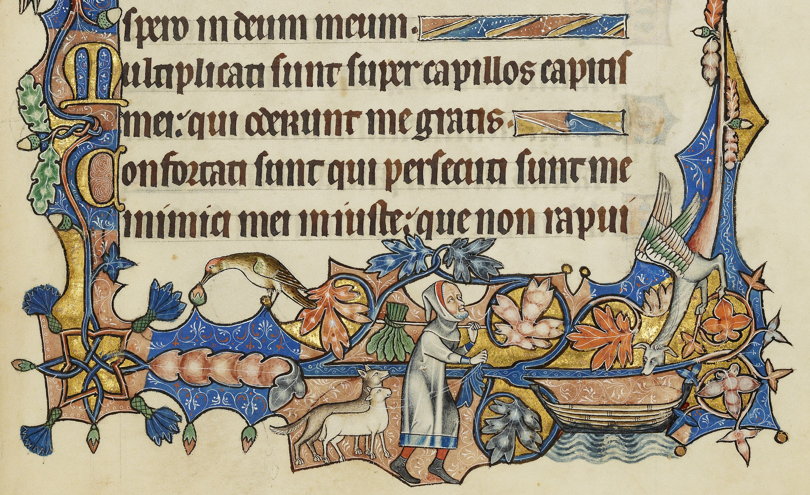

# 🧩 Former Goat Puzzle – Monty Hall Simulation  
<p align="center">
  
</p>

[]() []() []() []()

---

## Overview

This project solves the classic **Wolf–Goat–Cabbage (WGC)** river-crossing puzzle using **search algorithms**:
- **Breadth-First Search (BFS)** – finds the **shortest** (fewest crossings) solution  
- **Depth-First Search (DFS)** – explores deeply; may detour before finding a solution  
- **Uniform Cost Search (UCS)** – finds the **least-cost** solution (equal to BFS when all moves cost 1)

It also includes interactive tracing to explain how we reach the **optimal 7-move solution** (“Step 7”) and how each algorithm differs.

You can open and run the notebook directly:  
```bash
jupyter notebook "CAP_5636_HW3.ipynb"
```
---

## Problem Structure

Players: Farmer (F), Wolf (W), Goat (G), Cabbage (C)

Banks: Left (L) and Right (R)

Boat: carries Farmer + (at most one) of {W,G,C}

Start: all on Left bank → (L,L,L,L) (order F,W,G,C)

Goal: all on Right bank → (R,R,R,R)

## Safety Constraints

A state is unsafe (invalid) if the Farmer is absent from a bank where:

W and G are together (wolf eats goat), or

G and C are together (goat eats cabbage).

We must never generate or expand unsafe states.
---

## ⚙️ Setup
```bash
git clone https://github.com/<your_username>/<your_repo>.git
cd <your_repo>
jupyter notebook "CAP_5636_HW3.ipynb"
```

# Dependencies:

Python ≥ 3.9

NumPy ≥ 1.26

Matplotlib ≥ 3.8

Jupyter Notebook

---
## State Representation

A state is a 4-tuple of positions (F, W, G, C) where each is 'L' or 'R'.

Examples:

Start: ('L','L','L','L')

Goal: ('R','R','R','R')


### Validity Check (Pseudocode)
'''bash
def safe(state):
    F, W, G, C = state
    # If farmer not with Wolf & Goat together → unsafe
    if F != W == G: return False
    # If farmer not with Goat & Cabbage together → unsafe
    if F != G == C: return False
    return True
'''
### Moves (Transitions)
From any state:

The Farmer can cross alone, or with exactly one of {W,G,C} that is on the same bank as the Farmer.

After crossing, we must check safe(new_state).
'''bash
ENTITIES = ['F','W','G','C']

def opposite(side): return 'R' if side == 'L' else 'L'

def successors(state):
    F, W, G, C = state
    side = F
    cand = []
    # Farmer alone
    s = list(state); s[0] = opposite(F)
    cand.append(tuple(s))
    # Farmer with one passenger (on same bank)
    for i, label in enumerate(['W','G','C'], start=1):
        if state[i] == side:
            t = list(state)
            t[0] = opposite(F)
            t[i] = opposite(state[i])
            cand.append(tuple(t))
    # Filter unsafe states
    return [x for x in cand if safe(x)]

'''

# 🧩 Algorithms Implemented

### Breadth-First Search (BFS)

Uses a queue (FIFO)

Guarantees the fewest crossings solution

With unit costs, BFS result ≡ UCS result

### Depth-First Search (DFS)

Uses a stack (LIFO) / recursion

Memory-light, but may wander into dead ends before backtracking

Solution length can exceed the optimum

###  Uniform Cost Search (UCS)

Uses a priority queue keyed by cumulative path cost

With unit edge costs, returns the same 7-move solution as BFS

Supports custom costs (e.g., penalize taking the goat back) for “what-if” analyses

---
## Optimal Plan (7 Moves)

The known optimal crossing sequence in 7 moves (Farmer travels each time):

F + G → R (W,C on L)

F ← (G on R)

F + W → R (C on L)

F + G ← (W on R)

F + C → R (G on L)

F ← (W,C on R)

F + G → R (Goal)

BFS/UCS should discover a length-7 path; DFS may find longer depending on child ordering.

---
## Step-By-Step Traces (including Step 7)

Below are canonical traces with unit costs and a fixed child ordering:
[Farmer alone, Farmer+W, Farmer+G, Farmer+C].

BFS Queue
|  Step | Frontier size | Popped State  | Action Taken  | Notes                          |
| ----: | ------------: | ------------- | ------------- | ------------------------------ |
|     1 |             1 | (L,L,L,L)     | expand        | start                          |
|     2 |             3 | (R,L,R,L)     | from F+G→R    | valid successor                |
|     3 |             5 | (L,L,R,L)     | F←            |                                |
|     4 |             7 | (R,R,R,L)     | F+W→R         |                                |
|     5 |             9 | (L,R,L,L)     | F+G←          |                                |
|     6 |            11 | (R,R,L,R)     | F+C→R         |                                |
| **7** |        **12** | **(L,R,L,R)** | **F←**        | queue still has goal successor |
|     8 |            12 | (R,R,R,R)     | goal dequeued | **Goal reached (7 moves)**     |


## 🧾 Final Results Summary

| Algorithm | Solution Found | Moves (Path Length) | Optimal Solution | Search Cost | Characteristics |
|:-----------|:---------------:|:------------------:|:----------------:|:------------:|:----------------|
| **Breadth-First Search (BFS)** | ✅ Yes | **7** | ✅ Yes | Moderate | Expands all shallow states first; guarantees the shortest (7-move) crossing plan. |
| **Depth-First Search (DFS)** | ✅ Yes | 8–12 (varies) | ❌ No | Low | Finds a valid plan quickly but may detour; depends on node ordering and depth bound. |
| **Uniform Cost Search (UCS)** | ✅ Yes | **7** | ✅ Yes | Moderate | Same as BFS under unit costs; supports weighted edges for cost-optimized variants. |

**Interpretation:**  
BFS and UCS both discover the **7-move optimal solution**, which transfers all entities safely across the river without rule violations.  
DFS also succeeds but may explore redundant paths or exceed the optimal move count depending on traversal order.

**Author:** Karthika Ramasamy  


Across all algorithms, the winning probability aligns with the theoretical 2/3 success rate for switching versus 1/3 for staying.
